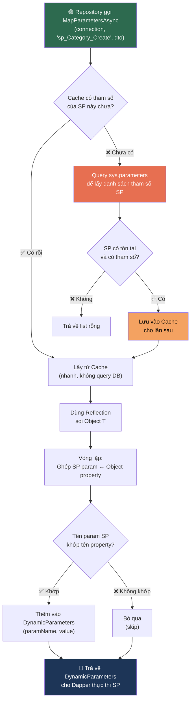

# Tài liệu chi tiết Luồng Đa ngôn ngữ (Localization)

Tài liệu này giải thích chi tiết cách triển khai tính năng đa ngôn ngữ cho hệ thống Validation trong project Clean Architecture của bạn.

---

## 1. Kiến trúc tổng thể
Chúng ta triển khai Localization theo mô hình **Shared Resources** (Tài nguyên dùng chung). Thay vì mỗi Class có một file ngôn ngữ riêng, chúng ta tập hợp tất cả thông báo vào một nơi để dễ quản lý.

-   **Marker Class**: `SharedResource.cs` đóng vai trò là "mỏ neo" để .NET biết nơi bắt đầu tìm kiếm các file `.resx`.
-   **Resource Files**: Các file `.resx` (XML) chứa các cặp Key-Value cho từng ngôn ngữ.
-   **DTOs**: Sử dụng các "Key" thay vì chuỗi văn bản cố định.

---

## 2. Các bước triển khai chi tiết

### Bước 1: Tạo Marker Class và Resource Files
Chúng ta đặt tài nguyên tại tầng **Application** vì đây là nơi chứa các DTO và Logic nghiệp vụ cần thông báo lỗi.

-   **File**: `MyApp.Application/Resources/SharedResource.cs`
-   **Nhiệm vụ**: Class này phải là `public` và trống (không cần code). Nó chỉ dùng để lấy thông tin về `Namespace` và `Assembly`.
-   **Các file ngôn ngữ**: `SharedResource.vi.resx` (Tiếng Việt) và `SharedResource.en.resx` (Tiếng Anh). Những file này phải nằm **cùng thư mục** với marker class.

### Bước 2: Cấu hình trong Service (Program.cs)
Tại project Web API, chúng ta cần đăng ký các dịch vụ cần thiết:

1.  **AddLocalization**: Đăng ký dịch vụ bản địa hóa cơ bản.
2.  **AddDataAnnotationsLocalization**: Cấu hình để các thuộc tính như `[Required]`, `[StringLength]` trong DTO biết tìm thông báo ở đâu.

### Bước 3: Cấu hình Middleware (Xử lý Request)
Để hệ thống biết người dùng muốn dùng ngôn ngữ nào, chúng ta dùng `RequestLocalizationOptions`.

---

## 3. Luồng hoạt động khi có Request (Flow)
   
1.  **Request gửi đến**: Người dùng gọi API kèm `?culture=en-US`.
2.  **Nhận diện ngôn ngữ**: Middleware thiết lập `CultureInfo.CurrentCulture`.
3.  **Validation**: ASP.NET Core kiểm tra DTO.
4.  **Tìm kiếm chuỗi dịch**: Hệ thống tìm Key trong file `.resx` tương ứng.
5.  **Trả về kết quả**: Thông báo lỗi đã được dịch.

---

## 4. Các lưu ý quan trọng để không bị lỗi

> [!WARNING]
> **Namespace và Thư mục**: Namespace của `SharedResource.cs` phải khớp hoàn toàn với cấu trúc thư mục chứa file `.resx`.

> [!TIP]
> **Rebuild**: Mỗi khi bạn sửa file `.resx`, hãy **Rebuild** lại Project.

---

## 5. Giải thích chi tiết DapperHelper (Magic Mapping) 🪄

> [!NOTE]
> Phần này giải thích **từng dòng code** trong file `DapperHelper.cs`. Nếu bạn là intern, hãy đọc kỹ phần "Kiến thức nền tảng" trước khi đi vào phân tích code.

---

### 5.0. Bài toán: Tại sao cần DapperHelper?

Khi bạn gọi một Stored Procedure (SP) bằng Dapper, bạn thường phải viết thế này:

```csharp
// ❌ Cách thủ công — phải khai báo từng tham số bằng tay
var parameters = new DynamicParameters();
parameters.Add("@Id", category.Id);
parameters.Add("@Name", category.Name);
parameters.Add("@Code", category.Code);
parameters.Add("@Description", category.Description);
// ... cứ thế lặp lại cho mỗi SP khác nhau 😩
```

**Vấn đề**:
- Mỗi khi thêm/xoá cột trong SP → phải sửa lại code C# → **dễ quên, dễ sai**.
- Nếu có 50 SP → phải viết 50 chỗ giống nhau → **lặp code kinh khủng**.
- Truyền thừa tham số mà SP không cần → **lỗi runtime**.

**Giải pháp**: `DapperHelper` tự động đọc SP cần tham số gì, rồi tự lấy từ object C# của bạn. Bạn chỉ cần viết **1 dòng**:

```csharp
// ✅ Cách tự động — DapperHelper lo hết
var parameters = await DapperHelper.MapParametersAsync(connection, "sp_Category_Create", categoryDto);
```

---

### 5.1. Kiến thức nền tảng (Đọc trước khi xem code)

####  Reflection là gì?
Reflection là khả năng của C# cho phép **"soi gương" một object** lúc chương trình đang chạy (runtime). Nghĩa là bạn có thể:
- Biết object đó có những thuộc tính (property) nào
- Đọc tên, kiểu dữ liệu, và giá trị của từng property
- Mà **không cần biết trước** object đó là class gì

```csharp
// Ví dụ: "soi" object category để biết nó có những gì
var props = typeof(Category).GetProperties();
// Kết quả: [Id, Name, Code, Description, RecordStatus, ...]
// → Giống như bạn mở class ra xem vậy, nhưng làm lúc runtime!
```

####  ConcurrentDictionary là gì?
- Là một **Dictionary đặc biệt** an toàn khi nhiều thread truy cập cùng lúc.
- Web API nhận nhiều request song song → nhiều thread chạy đồng thời → nếu dùng `Dictionary` thường → **crash hoặc mất dữ liệu**.
- `ConcurrentDictionary` giải quyết vấn đề này bằng cơ chế khóa (locking) nội bộ.

```
Ví dụ tưởng tượng thực tế:
Dictionary       = 1 cuốn sổ, 10 người cùng viết vào → chữ đè lên nhau → hỏng
ConcurrentDict   = 1 cuốn sổ, nhưng có khóa → mỗi lần chỉ 1 người viết → an toàn
```

####  `sys.parameters` là gì?
- SQL Server lưu **metadata** (thông tin về cấu trúc) của mọi SP trong các bảng hệ thống.
- `sys.parameters` là bảng chứa danh sách tham số của tất cả SP.

```sql
-- Ví dụ: Hỏi SQL Server "SP sp_Category_Create cần tham số gì?"
SELECT name FROM sys.parameters WHERE object_id = OBJECT_ID('sp_Category_Create');
-- Kết quả:
-- @Id
-- @Name
-- @Code
-- @Description
```

---

### 5.2. Phân tích code từng dòng

#### Phần 1: Khai báo class và Cache

```csharp
public static class DapperHelper
```
- `static class` = class **không cần tạo instance** (không cần `new DapperHelper()`).
- Gọi trực tiếp: `DapperHelper.MapParametersAsync(...)`.
- Dùng `static` vì đây là class tiện ích (utility), không lưu trạng thái riêng cho từng request.

```csharp
private static readonly ConcurrentDictionary<string, List<string>> _spParamCache = new();
```

| Thành phần | Ý nghĩa |
|---|---|
| `private` | Chỉ dùng nội bộ trong class này |
| `static` | Tồn tại **duy nhất 1 bản** cho toàn bộ ứng dụng (shared) |
| `readonly` | Chỉ gán giá trị **1 lần** khi khởi tạo, không ai đổi được |
| `ConcurrentDictionary<string, List<string>>` | Key = tên SP, Value = danh sách tham số |

**Ví dụ dữ liệu trong cache sau khi chạy:**
```
{
  "sp_Category_Create":  ["@Id", "@Name", "@Code", "@Description"],
  "sp_Category_Update":  ["@Id", "@Name", "@Code"],
  "sp_Product_Create":   ["@Id", "@ProductName", "@Price", "@CategoryId"]
}
```

→ Lần đầu gọi SP → query database để lấy → **lưu cache**.
→ Các lần sau → lấy từ cache → **nhanh hơn rất nhiều** (không cần hỏi DB nữa).

---

#### Phần 2: Phương thức chính — `MapParametersAsync<T>`

```csharp
public static async Task<DynamicParameters> MapParametersAsync<T>(
    IDbConnection connection,  // Kết nối đến DB
    string spName,             // Tên Stored Procedure, ví dụ "sp_Category_Create"
    T obj                      // Object chứa dữ liệu, ví dụ categoryDto
)
```

- `<T>` là **Generic** — nghĩa là method này hoạt động với **BẤT KỲ class nào**: `CategoryDto`, `ProductDto`, `UserDto`... mà không cần viết lại.
- Trả về `DynamicParameters` — đây là cách Dapper đóng gói tham số để truyền vào SP.

**Dòng 19:** Lấy danh sách tham số mà SP yêu cầu
```csharp
var spParams = await GetSpParametersAsync(connection, spName);
// spParams = ["@Id", "@Name", "@Code", "@Description"]
```

**Dòng 20:** Tạo "túi" chứa tham số Dapper (ban đầu rỗng)
```csharp
var dynamicParams = new DynamicParameters();
// dynamicParams = {} (rỗng, chờ bỏ dữ liệu vào)
```

**Dòng 23:** Dùng Reflection để "soi" object T
```csharp
var properties = typeof(T).GetProperties(BindingFlags.Public | BindingFlags.Instance);
```
- `BindingFlags.Public` → chỉ lấy property `public` (không lấy `private`).
- `BindingFlags.Instance` → chỉ lấy property của instance (không lấy `static`).
- Kết quả ví dụ nếu `T` là `CreateCategoryParams`:
```
properties = [
  { Name: "Id",          Value: "abc-123" },
  { Name: "Name",        Value: "Điện thoại" },
  { Name: "Code",        Value: "DT" },
  { Name: "Description", Value: "Mô tả..." },
  { Name: "CreatedBy",   Value: "admin" }   ← thuộc tính thừa, SP không cần
]
```

**Dòng 25-37:** Vòng lặp — "ghép đôi" SP param với Object property
```csharp
foreach (var paramName in spParams)  // Duyệt: "@Id", "@Name", "@Code", "@Description"
{
    // "@Name" → "Name" (bỏ dấu @)
    var cleanParamName = paramName.StartsWith("@") ? paramName.Substring(1) : paramName;

    // Tìm property có tên khớp, không phân biệt HOA/thường
    var prop = properties.FirstOrDefault(p =>
        p.Name.Equals(cleanParamName, StringComparison.OrdinalIgnoreCase));

    if (prop != null)  // Tìm thấy → bỏ vào túi
    {
        dynamicParams.Add(paramName, prop.GetValue(obj));
        // Ví dụ: dynamicParams.Add("@Name", "Điện thoại")
    }
    // Không tìm thấy → bỏ qua, không báo lỗi (âm thầm skip)
}
```

**Minh hoạ bảng ghép đôi:**

| SP cần (spParams) | Bỏ @ | Property trong Object | Khớp? | Giá trị truyền đi |
|---|---|---|---|---|
| `@Id` | `Id` | `Id` | ✅ | `"abc-123"` |
| `@Name` | `Name` | `Name` | ✅ | `"Điện thoại"` |
| `@Code` | `Code` | `Code` | ✅ | `"DT"` |
| `@Description` | `Description` | `Description` | ✅ | `"Mô tả..."` |
| — | — | `CreatedBy` | ❌ SP không cần | **Bị bỏ qua** |

→ Kết quả: Chỉ truyền đúng 4 tham số mà SP cần. `CreatedBy` thừa thì tự động bị lọc.

---

#### Phần 3: Phương thức phụ — `GetSpParametersAsync`

Đây là "thám tử" chuyên hỏi Database: *"Ê SQL Server, SP này cần tham số gì?"*

```csharp
private static async Task<List<string>> GetSpParametersAsync(
    IDbConnection connection,
    string spName
)
```

**Bước 1: Kiểm tra cache trước**
```csharp
if (_spParamCache.TryGetValue(spName, out var cachedParams))
{
    return cachedParams;  // Đã hỏi rồi → trả về luôn, không cần hỏi DB
}
```

**Bước 2: Nếu chưa có trong cache → Hỏi SQL Server**
```csharp
const string sql = @"
    SELECT name
    FROM sys.parameters
    WHERE object_id = OBJECT_ID(@spName)";

var parameters = await connection.QueryAsync<string>(sql, new { spName });
var paramList = parameters.ToList();
```
- `sys.parameters` = bảng hệ thống chứa metadata của tham số.
- `OBJECT_ID(@spName)` = lấy ID nội bộ của SP trong SQL Server.
- Kết quả trả về: `["@Id", "@Name", "@Code", "@Description"]`.

**Bước 3: Lưu vào cache để lần sau dùng lại**
```csharp
if (paramList.Any())  // Chỉ cache nếu SP thực sự tồn tại và có tham số
{
    _spParamCache.TryAdd(spName, paramList);
}
```

---

### 5.3. Luồng hoạt động tổng thể (Flow Diagram)



---

### 5.4. Ví dụ thực tế trong project

Khi Repository muốn gọi SP tạo Category:

```csharp
// Trong CategoryRepository_Store.cs
public async Task<SpResponse> CreateAsync(CreateCategoryParams dto)
{
    using var connection = _context.CreateConnection();

    // 🪄 1 dòng duy nhất — DapperHelper lo mọi thứ
    var parameters = await DapperHelper.MapParametersAsync(connection, "sp_Category_Create", dto);

    // Gọi SP với tham số đã được map tự động
    var result = await connection.QueryFirstOrDefaultAsync<SpResponse>(
        "sp_Category_Create",
        parameters,
        commandType: CommandType.StoredProcedure
    );

    return result;
}
```

**Không cần viết:**
```csharp
// ❌ Không cần làm thế này nữa!
parameters.Add("@Id", dto.Id);
parameters.Add("@Name", dto.Name);
parameters.Add("@Code", dto.Code);
// ...
```

---

### 5.5. Tại sao gọi là "Magic Mapping"? ✨

| Đặc điểm | Giải thích |
|---|---|
| **Tự động hóa** | Thêm cột ở SP + Entity → Code tự chạy, **không cần sửa Repository** |
| **Lọc thông minh** | Chỉ truyền những gì SP cần, tránh lỗi `"Too many arguments"` |
| **Hiệu năng tốt** | Reflection chậm, nhưng có Cache nên chỉ "soi" metadata **1 lần** |
| **Generic** | Hoạt động với mọi class (`T`) — không cần viết helper riêng cho từng entity |

---

### 5.6. Các lỗi thường gặp & cách fix

> [!CAUTION]
> **Lỗi 1: Tên property C# ≠ Tên tham số SQL**
> ```
> // C# class                    // SQL SP
> public string CategoryName     @Name    ← KHÔNG KHỚP!
> ```
> **Fix**: Đổi tên property C# thành `Name` hoặc đổi tên tham số SQL thành `@CategoryName`.

> [!WARNING]
> **Lỗi 2: SP không tồn tại trong Database**
> `GetSpParametersAsync` sẽ trả về list rỗng → `MapParametersAsync` trả về `DynamicParameters` rỗng → SP chạy thiếu tham số → **lỗi SQL runtime**.
> **Fix**: Kiểm tra SP đã được deploy đúng vào database chưa.

> [!WARNING]
> **Lỗi 3: Cache cũ sau khi sửa SP**
> Nếu bạn sửa tham số SP (thêm/xoá cột) mà app vẫn đang chạy → cache vẫn giữ danh sách cũ → truyền thiếu/thừa tham số.
> **Fix**: **Restart ứng dụng** sau khi sửa SP để cache được reset.

> [!IMPORTANT]
> **Quy tắc vàng duy nhất**: Đảm bảo **Tên property trong C# class** giống hệt **Tên tham số trong SQL** (bỏ dấu `@`). Chỉ cần tuân thủ điều này, DapperHelper sẽ lo phần còn lại.


## giải thích hàm hepler cho Intern
# 📘 Giải thích chi tiết StoreHelper - Dành cho Intern

> Tài liệu này giải thích từng dòng code trong hệ thống **StoreHelper** mà anh vừa xây dựng.
> Mục tiêu: Giúp em hiểu **tại sao** viết như vậy, chứ không chỉ **viết gì**.

---

## 🗺️ Tổng quan luồng hoạt động (Flow)

Khi một API được gọi, luồng xử lý sẽ đi như sau:

```
Controller → Service → Repository → StoreHelper → DapperHelper → Database (Stored Procedure)
```

**Ví dụ cụ thể:** Khi người dùng gọi API `POST /api/categorystore` để thêm Category mới:

```
1. CategoryStoreController nhận request
2. CategoryStoreService xử lý business logic
3. CategoryRepository_store.AddAsync(category) được gọi
4. _storeHelper.QueryFirstOrDefaultAsync<SpResponse>("sp_InsertCategory", category)
5. StoreHelper lấy connection từ AppDbContext
6. DapperHelper.MapParametersAsync() tự động ánh xạ thuộc tính của category → tham số của SP
7. Dapper thực thi SP trên SQL Server
8. Kết quả SpResponse trả ngược lại về Controller → trả cho người dùng
```

---

## 📁 FILE 1: IStoreHelper.cs (Interface - Bản thiết kế)

**Đường dẫn:** `MyApp.Domain/Interfaces_store/IStoreHelper.cs`

**Vai trò:** Đây là "bản hợp đồng" (contract). Nó chỉ khai báo "tôi có thể làm gì" mà KHÔNG nói "tôi làm như thế nào". Đây là nguyên tắc cốt lõi của **Clean Architecture** — tầng Domain không biết gì về Database, Dapper, hay SQL Server cả.

```csharp
using System.Collections.Generic;   // Để dùng IEnumerable<T> (danh sách)
using System.Threading.Tasks;       // Để dùng Task (bất đồng bộ - async)

namespace MyApp.Domain.Interfaces_store
{
    public interface IStoreHelper
    {
```

### Phương thức 1: `QueryAsync<T>`
```csharp
        Task<IEnumerable<T>> QueryAsync<T>(string spName, object? parameters = null);
```
- **`Task<...>`**: Đánh dấu đây là hàm bất đồng bộ (async). Nghĩa là nó sẽ không "đứng chờ" database trả kết quả mà để thread khác làm việc khác trong lúc chờ.
- **`IEnumerable<T>`**: Trả về một danh sách. `T` là kiểu generic — có thể là `Category`, `Product`, hay bất kỳ class nào.
- **`string spName`**: Tên Stored Procedure cần gọi, ví dụ `"sp_GetAllCategories"`.
- **`object? parameters = null`**: Tham số truyền vào SP. Dấu `?` nghĩa là cho phép `null`. `= null` nghĩa là nếu không truyền gì thì mặc định là `null` (tức là SP không cần tham số, ví dụ `sp_GetAllCategories` không cần truyền gì cả).
- **Khi nào dùng?** Khi em cần lấy **nhiều dòng** dữ liệu (ví dụ: danh sách tất cả Category).

### Phương thức 2: `QueryFirstOrDefaultAsync<T>`
```csharp
        Task<T?> QueryFirstOrDefaultAsync<T>(string spName, object? parameters = null);
```
- **`T?`**: Trả về **1 object duy nhất**, hoặc `null` nếu không tìm thấy.
- **Khi nào dùng?** Khi em cần lấy **1 dòng** dữ liệu (ví dụ: lấy Category theo Id, hoặc nhận kết quả SpResponse từ Insert/Update/Delete).

### Phương thức 3: `ExecuteAsync`
```csharp
        Task<int> ExecuteAsync(string spName, object? parameters = null);
```
- **`int`**: Trả về số dòng bị ảnh hưởng (affected rows).
- **Khi nào dùng?** Khi em chỉ cần thực thi SP mà không cần nhận kết quả chi tiết (ví dụ: xóa dữ liệu đơn giản).

```csharp
    }
}
```

---

## 📁 FILE 2: DapperHelper.cs (Bộ não ánh xạ tham số)

**Đường dẫn:** `MyApp.Infrastructure/Helpers/DapperHelper.cs`

**Vai trò:** Đây là "phép thuật" cốt lõi. Nó tự động đọc tên các tham số của Stored Procedure từ database, rồi so khớp với thuộc tính của object C# mà em truyền vào. Em không cần phải viết tay từng tham số nữa.

```csharp
    using Dapper;                       // Thư viện ORM siêu nhẹ để gọi SQL
    using System.Collections.Concurrent; // (Chưa dùng, có thể dùng cho cache sau này)
    using System.Collections.Generic;    // Để dùng List<T>
    using System.Data;                   // Để dùng IDbConnection
    using System.Linq;                   // Để dùng FirstOrDefault, ToList
    using System.Reflection;             // ⭐ Quan trọng: Để dùng Reflection (đọc thuộc tính của object lúc runtime)
    using System.Threading.Tasks;        // Để dùng Task (async)

    namespace MyApp.Infrastructure.Helpers
    {
        public static class DapperHelper  // "static" = không cần tạo instance, gọi thẳng DapperHelper.MapParametersAsync(...)
        {
```

### Hàm chính: `MapParametersAsync`
```csharp
            public static async Task<DynamicParameters> MapParametersAsync(
                IDbConnection connection,   // Kết nối database
                string spName,              // Tên Stored Procedure
                object? obj                 // Object chứa dữ liệu (Entity hoặc Anonymous object)
            )
            {
```

**Bước 1:** Lấy danh sách tham số của SP từ database
```csharp
                var spParams = await GetSpParametersAsync(connection, spName);
                // Ví dụ: sp_InsertCategory có tham số [@Name, @Description]
                // → spParams = ["@Name", "@Description"]
```

**Bước 2:** Tạo đối tượng DynamicParameters (là "túi chứa" tham số của Dapper)
```csharp
                var dynamicParams = new DynamicParameters();
```

**Bước 3:** Kiểm tra null — nếu không truyền object nào thì trả về túi rỗng
```csharp
                if (obj == null) return dynamicParams;
                // Ví dụ: sp_GetAllCategories không cần tham số → obj = null → trả về rỗng
```

**Bước 4:** Dùng **Reflection** để đọc danh sách thuộc tính (properties) của object
```csharp
                var properties = obj.GetType().GetProperties(BindingFlags.Public | BindingFlags.Instance);
                // obj.GetType() → lấy kiểu thực tế lúc runtime (ví dụ: Category)
                // GetProperties(...) → lấy tất cả thuộc tính public, không phải static
                // Ví dụ: Category có [Id, Name, Description] → properties = [Id, Name, Description]
```

> **💡 Tại sao dùng `obj.GetType()` mà không dùng `typeof(T)`?**
> Vì khi em truyền `new { Id = 1 }` (anonymous object), nếu dùng `typeof(T)` mà `T` là `object`,
> thì Reflection sẽ đọc thuộc tính của class `Object` (rỗng!) — sai hoàn toàn.
> `obj.GetType()` sẽ lấy đúng kiểu thực tế lúc chạy → đọc đúng thuộc tính.

**Bước 5:** Vòng lặp — so khớp từng tham số SP với thuộc tính của object
```csharp
                foreach (var paramName in spParams)     // Duyệt qua từng tham số SP
                {
                    // Tham số SP trong SQL có dạng "@Name", cần bỏ @ để so sánh
                    var cleanParamName = paramName.StartsWith("@") ? paramName.Substring(1) : paramName;
                    // "@Name" → "Name"

                    // Tìm thuộc tính C# có tên khớp (không phân biệt hoa/thường)
                    var prop = properties.FirstOrDefault(
                        p => p.Name.Equals(cleanParamName, System.StringComparison.OrdinalIgnoreCase)
                    );
                    // So sánh "Name" (SP) với "Name" (C# property) → KHỚP!
                    // OrdinalIgnoreCase = không phân biệt "name" vs "Name" vs "NAME"

                    if (prop != null)   // Nếu tìm thấy thuộc tính khớp
                    {
                        dynamicParams.Add(paramName, prop.GetValue(obj));
                        // prop.GetValue(obj) → lấy giá trị thực tế từ object
                        // Ví dụ: category.Name = "Điện thoại" → Add("@Name", "Điện thoại")
                    }
                    // Nếu SP có tham số mà object không có thuộc tính tương ứng → BỎ QUA (không lỗi)
                }

                return dynamicParams;
                // Trả về túi tham số đã được map xong → sẵn sàng để Dapper thực thi
            }
```

### Hàm phụ: `GetSpParametersAsync`
```csharp
            private static async Task<List<string>> GetSpParametersAsync(
                IDbConnection connection,
                string spName
            )
            {
                // Truy vấn bảng hệ thống sys.parameters của SQL Server
                // Bảng này chứa metadata của TẤT CẢ tham số của tất cả SP trong database
                const string sql = @"
                    SELECT name 
                    FROM sys.parameters 
                    WHERE object_id = OBJECT_ID(@spName)";
                // OBJECT_ID(@spName) → chuyển tên SP thành ID nội bộ của SQL Server
                // Ví dụ: OBJECT_ID('sp_InsertCategory') → 123456789

                var parameters = await connection.QueryAsync<string>(sql, new { spName });
                // Dapper thực thi câu SQL trên, truyền @spName vào
                // Kết quả: ["@Name", "@Description"]

                var paramList = parameters.ToList();
                return paramList;
            }
```

> **💡 Ý nghĩa thực tế:** Thay vì dev phải tự viết `new { Name = category.Name, Description = category.Description }`,
> DapperHelper tự động làm việc này bằng cách đọc metadata từ SQL Server + Reflection từ C#.
> → Khi SP thay đổi tham số, code C# **không cần sửa gì cả** (miễn là Entity có thuộc tính tương ứng).

---

## 📁 FILE 3: StoreHelper.cs (Lớp triển khai - "Người thợ thực sự")

**Đường dẫn:** `MyApp.Infrastructure/Helpers/StoreHelper.cs`

**Vai trò:** Đây là lớp thực hiện interface `IStoreHelper`. Nó đóng gói 3 việc:
1. Lấy kết nối database từ `AppDbContext`
2. Gọi `DapperHelper` để map tham số tự động
3. Dùng Dapper để thực thi Stored Procedure

```csharp
using Dapper;                           // Dapper ORM
using Microsoft.EntityFrameworkCore;     // Để dùng .Database.GetDbConnection()
using MyApp.Domain.Interfaces_store;     // Interface IStoreHelper
using MyApp.Infrastructure.Data.Context; // AppDbContext (EF Core context)
using System.Collections.Generic;
using System.Data;                       // CommandType.StoredProcedure
using System.Threading.Tasks;

namespace MyApp.Infrastructure.Helpers
{
    public class StoreHelper : IStoreHelper    // Triển khai interface IStoreHelper
    {
        private readonly AppDbContext _context;
        // "readonly" = chỉ gán giá trị 1 lần trong constructor, không ai sửa được sau đó
        // → Đảm bảo an toàn, tránh bug do vô tình thay đổi

        public StoreHelper(AppDbContext context)    // Constructor Injection (DI)
        {
            _context = context;
            // .NET DI container sẽ TỰ ĐỘNG truyền AppDbContext vào đây khi tạo StoreHelper
        }
```

### Phương thức 1: `QueryAsync<T>` — Lấy danh sách
```csharp
        public async Task<IEnumerable<T>> QueryAsync<T>(string spName, object? parameters = null)
        {
            // Bước 1: Lấy kết nối database từ EF Core context
            var connection = _context.Database.GetDbConnection();
            // EF Core quản lý connection pool, nên ta không cần tự mở/đóng connection
            // GetDbConnection() trả về IDbConnection đã được quản lý

            // Bước 2: Gọi DapperHelper để tự động map tham số
            var dParams = await DapperHelper.MapParametersAsync(connection, spName, parameters);
            // Nếu parameters = null (ví dụ: sp_GetAll) → dParams = rỗng
            // Nếu parameters = category entity → dParams = {@Name: "abc", @Description: "xyz"}

            // Bước 3: Thực thi SP bằng Dapper và trả về danh sách kết quả
            return await connection.QueryAsync<T>(
                spName,                                // Tên SP: "sp_GetAllCategories"
                dParams,                               // Tham số đã được map
                commandType: CommandType.StoredProcedure // Nói cho Dapper biết đây là SP, không phải raw SQL
            );
            // Dapper tự động map kết quả trả về từ SP vào các object kiểu T
            // Ví dụ: mỗi dòng trong result set → 1 object Category
        }
```

### Phương thức 2: `QueryFirstOrDefaultAsync<T>` — Lấy 1 dòng
```csharp
        public async Task<T?> QueryFirstOrDefaultAsync<T>(string spName, object? parameters = null)
        {
            var connection = _context.Database.GetDbConnection();
            var dParams = await DapperHelper.MapParametersAsync(connection, spName, parameters);
            return await connection.QueryFirstOrDefaultAsync<T>(
                spName,
                dParams,
                commandType: CommandType.StoredProcedure
            );
            // QueryFirstOrDefaultAsync:
            //   - Nếu SP trả về ít nhất 1 dòng → lấy dòng ĐẦU TIÊN, map vào object T
            //   - Nếu SP trả về 0 dòng → trả về null (default)
            // → Rất phù hợp cho: GetById, Insert (trả SpResponse), Update, Delete
        }
```

### Phương thức 3: `ExecuteAsync` — Thực thi không cần kết quả chi tiết
```csharp
        public async Task<int> ExecuteAsync(string spName, object? parameters = null)
        {
            var connection = _context.Database.GetDbConnection();
            var dParams = await DapperHelper.MapParametersAsync(connection, spName, parameters);
            return await connection.ExecuteAsync(
                spName,
                dParams,
                commandType: CommandType.StoredProcedure
            );
            // ExecuteAsync: Trả về số dòng bị ảnh hưởng (affected rows)
            // Ví dụ: DELETE 3 dòng → trả về 3
            // Dùng khi em không cần đọc dữ liệu trả về, chỉ cần biết thành công hay không
        }
    }
}
```

---

## 📁 FILE 4: CategoryRepository_store.cs (Repository đã được refactor)

**Đường dẫn:** `MyApp.Infrastructure/Repositories_Store/CategoryRepository_store.cs`

**Vai trò:** Đây là nơi thực sự gọi các SP. Nhờ có `StoreHelper`, code ở đây cực kỳ gọn gàng.

```csharp
using Microsoft.Extensions.Localization;    // Đa ngôn ngữ (i18n)
using MyApp.Application.Resources;          // SharedResource (file .resx)
using MyApp.Domain.Common;                  // SpResponse
using MyApp.Domain.Entities;                // Category entity
using MyApp.Domain.Interfaces_store;        // ICategoryRepository_store, IStoreHelper
using System.Collections.Generic;
using System.Threading.Tasks;

namespace MyApp.Infrastructure.Repositories_Store
{
    public class CategoryRepository_store : ICategoryRepository_store 
    {
        private readonly IStoreHelper _storeHelper;                     // ⭐ Helper mới
        private readonly IStringLocalizer<SharedResource> _localizer;   // Đa ngôn ngữ

        // Constructor: .NET DI container tự động truyền 2 dependency vào
        public CategoryRepository_store(IStoreHelper storeHelper, IStringLocalizer<SharedResource> localizer)
        {
            _storeHelper = storeHelper;
            _localizer = localizer;
        }
```

### GetAll — Không cần tham số
```csharp
        public async Task<IEnumerable<Category>> GetAllCategoriesAsync()
        {
            return await _storeHelper.QueryAsync<Category>("sp_GetAllCategories");
            // Chỉ 1 DÒNG! Không truyền parameters → mặc định null
            // StoreHelper sẽ tự: lấy connection → map params (rỗng) → gọi SP → trả danh sách Category
        }
```

### GetById — Truyền Anonymous Object
```csharp
        public async Task<Category?> GetByIdAsync(int id)
        {
            return await _storeHelper.QueryFirstOrDefaultAsync<Category>(
                "sp_GetCategoryById", 
                new { Id = id }         // ← Anonymous object: tạo object nhanh có thuộc tính Id
            );
            // new { Id = id } tạo ra 1 object có 1 thuộc tính "Id"
            // DapperHelper sẽ so khớp "Id" (C#) với "@Id" (SP) → map giá trị vào
        }
```

### Add — Truyền Entity trực tiếp
```csharp
        public async Task<SpResponse> AddAsync(Category category)
        {
            var response = await _storeHelper.QueryFirstOrDefaultAsync<SpResponse>(
                "sp_InsertCategory", 
                category                // ← Truyền thẳng entity Category!
            );
            // DapperHelper sẽ đọc tất cả thuộc tính của Category (Id, Name, Description)
            // So khớp với tham số SP (@Name, @Description) → map tự động
            // SP trả về SpResponse {Success: true/false, Message: "..."}

            // Xử lý đa ngôn ngữ cho message trả về
            if (response != null && !string.IsNullOrEmpty(response.Message))
            {
                response.Message = _localizer[response.Message];
                // SP trả về key như "CATEGORY_CREATED_SUCCESS"
                // _localizer chuyển thành "Tạo danh mục thành công" (vi) hoặc "Category created" (en)
            }

            // Nếu response null (lỗi không mong đợi) → trả về lỗi mặc định
            return response ?? new SpResponse { Success = false, Message = _localizer["ERROR_UNKNOWN_DATABASE"] };
            // ?? = null-coalescing operator: nếu vế trái null → dùng vế phải
        }
```

### Update & Delete — Tương tự Add
```csharp
        public async Task<SpResponse> UpdateAsync(Category category)
        {
            var response = await _storeHelper.QueryFirstOrDefaultAsync<SpResponse>("sp_UpdateCategory", category);
            // Giống AddAsync, nhưng gọi sp_UpdateCategory
            // ...xử lý localize và null check giống nhau...
        }

        public async Task<SpResponse> DeleteAsync(int id)
        {
            var response = await _storeHelper.QueryFirstOrDefaultAsync<SpResponse>(
                "sp_DeleteCategory", 
                new { Id = id }     // Chỉ cần truyền Id
            );
            // ...xử lý localize và null check giống nhau...
        }
```

---

## 📁 FILE 5: Program.cs (Đăng ký Dependency Injection)

**Dòng quan trọng:**
```csharp
builder.Services.AddScoped<IStoreHelper, StoreHelper>();
```

**Giải thích:**
- `AddScoped` = Mỗi HTTP request tạo **1 instance** của `StoreHelper`, dùng chung trong suốt request đó, rồi tự hủy khi request kết thúc.
- `<IStoreHelper, StoreHelper>` = "Khi ai đó yêu cầu `IStoreHelper`, hãy tạo và trả về `StoreHelper`".
- Nhờ dòng này, khi `CategoryRepository_store` khai báo `IStoreHelper storeHelper` trong constructor, .NET DI container sẽ **tự động** tạo `StoreHelper` và truyền vào.

**Tại sao dùng `AddScoped` mà không phải `AddSingleton` hay `AddTransient`?**
- `AddSingleton`: 1 instance dùng cho toàn bộ app → **NGUY HIỂM** vì `AppDbContext` là `Scoped`, không thể inject `Scoped` vào `Singleton`.
- `AddTransient`: Tạo instance mới mỗi lần inject → lãng phí tài nguyên.
- `AddScoped`: 1 instance/request → **VỪA ĐỦ**, cùng lifecycle với `AppDbContext`.

---

## 🔑 Tóm tắt: Trước và Sau khi có StoreHelper

### ❌ TRƯỚC (Code cũ trong Repository):
```csharp
public async Task<SpResponse> AddAsync(Category category)
{
    var connection = _context.Database.GetDbConnection();                          // Dòng 1
    var parameters = await DapperHelper.MapParametersAsync(connection, "sp_InsertCategory", category);  // Dòng 2
    var response = await connection.QueryFirstOrDefaultAsync<SpResponse>(          // Dòng 3
        "sp_InsertCategory",                                                       // Dòng 4
        parameters,                                                                // Dòng 5
        commandType: CommandType.StoredProcedure                                   // Dòng 6
    );
    // ... xử lý localize ...
}
// → 6 dòng logic database, copy-paste ở MỌI phương thức
```

### ✅ SAU (Code mới với StoreHelper):
```csharp
public async Task<SpResponse> AddAsync(Category category)
{
    var response = await _storeHelper.QueryFirstOrDefaultAsync<SpResponse>("sp_InsertCategory", category);  // 1 DÒNG!
    // ... xử lý localize ...
}
// → 1 dòng, sạch sẽ, dễ đọc, dễ bảo trì
```

---

## 💡 Nguyên tắc thiết kế đã áp dụng

| Nguyên tắc | Giải thích |
|:---|:---|
| **DRY** (Don't Repeat Yourself) | Logic lấy connection + map params + gọi Dapper chỉ viết **1 lần** trong StoreHelper |
| **SRP** (Single Responsibility) | Mỗi class chỉ làm 1 việc: DapperHelper → map params, StoreHelper → thực thi SP, Repository → logic nghiệp vụ |
| **DIP** (Dependency Inversion) | Repository phụ thuộc vào `IStoreHelper` (abstraction), không phụ thuộc vào `StoreHelper` (implementation) |
| **Open/Closed** | Muốn thêm tính năng (logging, caching) → sửa `StoreHelper`, **không cần sửa** bất kỳ Repository nào |

---

> **📌 Lời khuyên cho em:** Khi tạo Repository mới (ví dụ: `ProductRepository_store`), em chỉ cần:
> 1. Inject `IStoreHelper` vào constructor
> 2. Gọi `_storeHelper.QueryAsync<T>("tên_sp")` hoặc `_storeHelper.QueryFirstOrDefaultAsync<T>("tên_sp", object)`
> 3. Xong! Không cần lo quản lý connection hay map tham số nữa 🎉
 


 # Giải thích cơ chế JWT (JSON Web Token) cho Thực tập sinh (Intern)

Chào em, với tư cách là một Senior, anh sẽ giải thích cho em về cách cơ chế xác thực rà soát (Authentication/Authorization) hoạt động trong dự án `MyApp.Api` của chúng ta sử dụng JWT nhé. Cách giải thích này sẽ đi từ cơ bản đến cách nó áp dụng thực tế vào codebase hiện tại.

## 1. JWT là gì?
**JWT (JSON Web Token)** là một tiêu chuẩn mở (RFC 7519) quy định cách truyền tải thông tin an toàn giữa các bên dưới dạng JSON object. Thông tin này có thể được xác minh và đáng tin cậy vì nó có chứa chữ ký số (digital signature).

Hãy tưởng tượng JWT giống như một **"Chiếc thẻ ra vào" (VIP Pass)**. Bạn đưa thông tin cá nhân (Username/Password) cho bảo vệ kiểm tra, nếu đúng, bảo vệ cấp cho bạn một cái Thẻ. Từ đó về sau, bạn muốn vào các phòng trong tòa nhà (gọi API), bạn chỉ cần đưa Thẻ này ra thay vì cứ phải khai báo lại Username/Password.

## 2. Cấu trúc của một Token JWT
Một JWT thực chất là một chuỗi string khá dài gồm 3 phần, được phân cách bởi dấu chấm `.`:
`Header.Payload.Signature`

- **Header**: Chứa thông tin về loại token (là JWT) và thuật toán mã hóa (VD: HMAC SHA256).
- **Payload (Data)**: Chứa các "Claims" (những thông tin mình muốn đính kèm vào token). Ví dụ: `UserId`, `Role`, `UserName`. (Lưu ý: Không bỏ mật khẩu hay dữ liệu nhạy cảm vào đây vì ai cũng có thể giải mã phần này trên Frontend).
- **Signature (Chữ ký)**: Đây là phần quan trọng nhất. Nó được tạo ra bằng cách gộp Header, Payload và 1 **SecretKey** (Chìa khóa bí mật chỉ Server biết) rồi mã hóa bằng thuật toán khai báo ở Header. Giúp Server xác nhận xem Token này có bị giả mạo trên đường truyền hay không.

## 3. Cấu hình JWT trong `MyApp.Api`
Nếu em mở file `appsettings.json`, em sẽ thấy cấu hình JWT của dự án chúng ta:

```json
"JwtSettings": {
  "SecretKey": "MySuperSecretKey_2026_!@#_VerySecure_123456789",
  "Issuer": "MyApp_Backend",
  "Audience": "MyApp_Frontend",
  "AccessTokenExpiration": 15,    // Token sống 15 phút
  "RefreshTokenExpiration": 43200 // Refresh token sống 30 ngày (tính bằng phút)
}
```

- **SecretKey**: Là khóa bí mật để ký Token (giống như con dấu của bảo vệ). Nếu ai/hacker có được chìa khóa này, họ có thể vào vai Server phát hành Token giả để chiếm toàn quyền. Do đó, phải giữ tuyệt mật tuyệt đối!
- **Issuer (Người cấp)**: Tên của hệ thống phát hành ra cái token này, ở đây là `MyApp_Backend`.
- **Audience (Người nhận)**: Tên của hệ thống dùng token này, ở đây quy ước là `MyApp_Frontend`.
- **AccessTokenExpiration**: Thời gian sống của Access Token (15 phút). Vì thẻ này có quyền lực cao, dùng trực tiếp để gọi API nên lỡ bị trộm thì cũng chỉ xài được 15 phút rồi hết hạn, tăng tính bảo mật.
- **RefreshTokenExpiration**: Thời gian sống của Refresh Token (thường lâu hơn, VD: 30 ngày). Khi Access Token hết hạn, mình dùng Refresh Token này để xin Backend cấp lại Access Token mới mà không bắt User phải gõ lại Password.

## 4. Luồng hoạt động (Flow) trong dự án

### Bước 1: Đăng nhập (Login)
1. **Client (Frontend/Postman)** gửi Request POST lên Endpoint `/api/auth/login` gồm `Username` và `Password`.
2. **Backend (MyApp.Api)** nhận request, kiểm tra trong DB (Database SQL Server qua repo Dapper) xem User này có tồn tại và đúng Password (đã hash mã hóa) hay không.
3. Nếu đúng => Backend dùng `SecretKey` để tạo ra 2 giá trị là:
   - `AccessToken` (mang thông tin User, Role... sống 15 phút).
   - `RefreshToken` (1 chuỗi random string lưu vào DB để cho phép làm mới Access Token).
4. Backend trả về JSON chứa cặp token này cho Client.

### Bước 2: Gọi các API được bảo vệ (Call Secured API)
1. Để lấy danh sách Category hay Product (các API bị khóa, yêu cầu đăng nhập, thường có gắn attribute `[Authorize]`), **Client** phải gắn `AccessToken` lấy được từ Bước 1 vào **Header** của Request HTTP theo cú pháp:
   ```http
   Authorization: Bearer <chuỗi_access_token>
   ```
2. **Backend** nhận được Request. Middleware `JwtBearer` của ASP.NET Core sẽ "chặn" Request này lại trước khi cho vào Controller để kiểm tra:
   - Token có đúng định dạng không?
   - Token hết hạn chưa (còn trong 15 phút không)?
   - Chữ ký (Signature) có đúng được tạo ra từ `SecretKey` của Server không? Bị sửa đổi giữa chừng không?
   - `Issuer` và `Audience` có đúng như cài đặt trong config không?
3. Nếu tất cả đều OK (Hợp lệ) => Cho phép Request đi tiếp vào `Controller`. Khi đó trong code, em có thể lấy thông tin User đang Request qua biến `HttpContext.User`. Ngược lại, nếu sai rớt ở bất cứ điều khoản nào => Trả về lỗi Http Status Code `401 Unauthorized` ngay lập tức.

### Bước 3: Làm mới Token (Refresh Token) 
Khi `AccessToken` bị hết thời hạn 15 phút:
1. Client cố gắng gọi vào API => Backend trả về lỗi `401 Unauthorized`.
2. Lúc này Frontend sẽ ngầm (không để User biết) gọi lên Endpoint API ví dụ: `/api/auth/refresh-token` gửi cái chuỗi `RefreshToken` (đã lưu ở phía FE).
3. Backend kiểm tra `RefreshToken` này trong Database xem: có đúng mặt mã này không? bị vô hiệu hóa (revoked) chưa? còn hạn (trong vòng 30 ngày) không?
4. Nếu hợp lệ, hệ thống tạo ra cặp `AccessToken` và `RefreshToken` mới tinh và trả ngược lại cho Client (đồng thời vô hiệu hóa bộ cũ).
5. Frontend lưu lại cái mới, và dùng cái `AccessToken` mới đó tự động gọi lại cái API ban nãy bị `401`. Toàn bộ luồng này User không hề hay biết và họ không phải trải qua cảnh cứ 15 phút bị văng ra bắt nhập lại mật khẩu.

---

**Tóm lại cho Intern dễ nhớ:**
- JWT giống như cái **Thẻ Nhân Viên** để vô công ty. Lúc xin thì cần **Mã nhân viên / Pass**. 
- Có thẻ rồi, mỗi lần qua cổng cứ quẹt thẻ. Máy (JWT Middleware) sẽ tự động coi dấu mộc (Signature - verify bằng `SecretKey`) có đúng do công ty cấp không, thẻ hết hạn (Expiration) chưa.
- Thẻ xài tầm 15 phút là bị hết hạn (do Rule công ty khắc nghiệt =]]). Khi đó phải dùng **Giấy xác nhận gia hạn (Refresh token)** mang tới phòng HCĐN để xin cấp cái Thẻ (Access Token) mới chứ không phải nộp lại Form xin việc (User/Pass).

Là lập trình viên .NET, em chỉ cần học làm quen với thư viện `System.IdentityModel.Tokens.Jwt` là có thể tự tay Generate token rồi nhé. Nếu có chỗ nào chưa rõ khi coi code `AuthService` hay `Program.cs` thì nhắn anh. Code vui nha!
