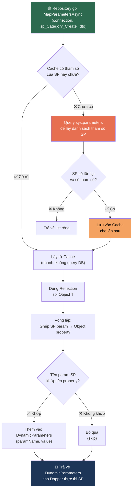

# Tài liệu chi tiết Luồng Đa ngôn ngữ (Localization)

Tài liệu này giải thích chi tiết cách triển khai tính năng đa ngôn ngữ cho hệ thống Validation trong project Clean Architecture của bạn.

---

## 1. Kiến trúc tổng thể
Chúng ta triển khai Localization theo mô hình **Shared Resources** (Tài nguyên dùng chung). Thay vì mỗi Class có một file ngôn ngữ riêng, chúng ta tập hợp tất cả thông báo vào một nơi để dễ quản lý.

-   **Marker Class**: `SharedResource.cs` đóng vai trò là "mỏ neo" để .NET biết nơi bắt đầu tìm kiếm các file `.resx`.
-   **Resource Files**: Các file `.resx` (XML) chứa các cặp Key-Value cho từng ngôn ngữ.
-   **DTOs**: Sử dụng các "Key" thay vì chuỗi văn bản cố định.

---

## 2. Các bước triển khai chi tiết

### Bước 1: Tạo Marker Class và Resource Files
Chúng ta đặt tài nguyên tại tầng **Application** vì đây là nơi chứa các DTO và Logic nghiệp vụ cần thông báo lỗi.

-   **File**: `MyApp.Application/Resources/SharedResource.cs`
-   **Nhiệm vụ**: Class này phải là `public` và trống (không cần code). Nó chỉ dùng để lấy thông tin về `Namespace` và `Assembly`.
-   **Các file ngôn ngữ**: `SharedResource.vi.resx` (Tiếng Việt) và `SharedResource.en.resx` (Tiếng Anh). Những file này phải nằm **cùng thư mục** với marker class.

### Bước 2: Cấu hình trong Service (Program.cs)
Tại project Web API, chúng ta cần đăng ký các dịch vụ cần thiết:

1.  **AddLocalization**: Đăng ký dịch vụ bản địa hóa cơ bản.
2.  **AddDataAnnotationsLocalization**: Cấu hình để các thuộc tính như `[Required]`, `[StringLength]` trong DTO biết tìm thông báo ở đâu.

### Bước 3: Cấu hình Middleware (Xử lý Request)
Để hệ thống biết người dùng muốn dùng ngôn ngữ nào, chúng ta dùng `RequestLocalizationOptions`.

---

## 3. Luồng hoạt động khi có Request (Flow)
   
1.  **Request gửi đến**: Người dùng gọi API kèm `?culture=en-US`.
2.  **Nhận diện ngôn ngữ**: Middleware thiết lập `CultureInfo.CurrentCulture`.
3.  **Validation**: ASP.NET Core kiểm tra DTO.
4.  **Tìm kiếm chuỗi dịch**: Hệ thống tìm Key trong file `.resx` tương ứng.
5.  **Trả về kết quả**: Thông báo lỗi đã được dịch.

---

## 4. Các lưu ý quan trọng để không bị lỗi

> [!WARNING]
> **Namespace và Thư mục**: Namespace của `SharedResource.cs` phải khớp hoàn toàn với cấu trúc thư mục chứa file `.resx`.

> [!TIP]
> **Rebuild**: Mỗi khi bạn sửa file `.resx`, hãy **Rebuild** lại Project.

---

## 5. Giải thích chi tiết DapperHelper (Magic Mapping) 🪄

> [!NOTE]
> Phần này giải thích **từng dòng code** trong file `DapperHelper.cs`. Nếu bạn là intern, hãy đọc kỹ phần "Kiến thức nền tảng" trước khi đi vào phân tích code.

---

### 5.0. Bài toán: Tại sao cần DapperHelper?

Khi bạn gọi một Stored Procedure (SP) bằng Dapper, bạn thường phải viết thế này:

```csharp
// ❌ Cách thủ công — phải khai báo từng tham số bằng tay
var parameters = new DynamicParameters();
parameters.Add("@Id", category.Id);
parameters.Add("@Name", category.Name);
parameters.Add("@Code", category.Code);
parameters.Add("@Description", category.Description);
// ... cứ thế lặp lại cho mỗi SP khác nhau 😩
```

**Vấn đề**:
- Mỗi khi thêm/xoá cột trong SP → phải sửa lại code C# → **dễ quên, dễ sai**.
- Nếu có 50 SP → phải viết 50 chỗ giống nhau → **lặp code kinh khủng**.
- Truyền thừa tham số mà SP không cần → **lỗi runtime**.

**Giải pháp**: `DapperHelper` tự động đọc SP cần tham số gì, rồi tự lấy từ object C# của bạn. Bạn chỉ cần viết **1 dòng**:

```csharp
// ✅ Cách tự động — DapperHelper lo hết
var parameters = await DapperHelper.MapParametersAsync(connection, "sp_Category_Create", categoryDto);
```

---

### 5.1. Kiến thức nền tảng (Đọc trước khi xem code)

#### 🔍 Reflection là gì?
Reflection là khả năng của C# cho phép **"soi gương" một object** lúc chương trình đang chạy (runtime). Nghĩa là bạn có thể:
- Biết object đó có những thuộc tính (property) nào
- Đọc tên, kiểu dữ liệu, và giá trị của từng property
- Mà **không cần biết trước** object đó là class gì

```csharp
// Ví dụ: "soi" object category để biết nó có những gì
var props = typeof(Category).GetProperties();
// Kết quả: [Id, Name, Code, Description, RecordStatus, ...]
// → Giống như bạn mở class ra xem vậy, nhưng làm lúc runtime!
```

#### 🧠 ConcurrentDictionary là gì?
- Là một **Dictionary đặc biệt** an toàn khi nhiều thread truy cập cùng lúc.
- Web API nhận nhiều request song song → nhiều thread chạy đồng thời → nếu dùng `Dictionary` thường → **crash hoặc mất dữ liệu**.
- `ConcurrentDictionary` giải quyết vấn đề này bằng cơ chế khóa (locking) nội bộ.

```
Ví dụ tưởng tượng thực tế:
Dictionary       = 1 cuốn sổ, 10 người cùng viết vào → chữ đè lên nhau → hỏng
ConcurrentDict   = 1 cuốn sổ, nhưng có khóa → mỗi lần chỉ 1 người viết → an toàn
```

#### 🗄️ `sys.parameters` là gì?
- SQL Server lưu **metadata** (thông tin về cấu trúc) của mọi SP trong các bảng hệ thống.
- `sys.parameters` là bảng chứa danh sách tham số của tất cả SP.

```sql
-- Ví dụ: Hỏi SQL Server "SP sp_Category_Create cần tham số gì?"
SELECT name FROM sys.parameters WHERE object_id = OBJECT_ID('sp_Category_Create');
-- Kết quả:
-- @Id
-- @Name
-- @Code
-- @Description
```

---

### 5.2. Phân tích code từng dòng

#### Phần 1: Khai báo class và Cache

```csharp
public static class DapperHelper
```
- `static class` = class **không cần tạo instance** (không cần `new DapperHelper()`).
- Gọi trực tiếp: `DapperHelper.MapParametersAsync(...)`.
- Dùng `static` vì đây là class tiện ích (utility), không lưu trạng thái riêng cho từng request.

```csharp
private static readonly ConcurrentDictionary<string, List<string>> _spParamCache = new();
```

| Thành phần | Ý nghĩa |
|---|---|
| `private` | Chỉ dùng nội bộ trong class này |
| `static` | Tồn tại **duy nhất 1 bản** cho toàn bộ ứng dụng (shared) |
| `readonly` | Chỉ gán giá trị **1 lần** khi khởi tạo, không ai đổi được |
| `ConcurrentDictionary<string, List<string>>` | Key = tên SP, Value = danh sách tham số |

**Ví dụ dữ liệu trong cache sau khi chạy:**
```
{
  "sp_Category_Create":  ["@Id", "@Name", "@Code", "@Description"],
  "sp_Category_Update":  ["@Id", "@Name", "@Code"],
  "sp_Product_Create":   ["@Id", "@ProductName", "@Price", "@CategoryId"]
}
```

→ Lần đầu gọi SP → query database để lấy → **lưu cache**.
→ Các lần sau → lấy từ cache → **nhanh hơn rất nhiều** (không cần hỏi DB nữa).

---

#### Phần 2: Phương thức chính — `MapParametersAsync<T>`

```csharp
public static async Task<DynamicParameters> MapParametersAsync<T>(
    IDbConnection connection,  // Kết nối đến DB
    string spName,             // Tên Stored Procedure, ví dụ "sp_Category_Create"
    T obj                      // Object chứa dữ liệu, ví dụ categoryDto
)
```

- `<T>` là **Generic** — nghĩa là method này hoạt động với **BẤT KỲ class nào**: `CategoryDto`, `ProductDto`, `UserDto`... mà không cần viết lại.
- Trả về `DynamicParameters` — đây là cách Dapper đóng gói tham số để truyền vào SP.

**Dòng 19:** Lấy danh sách tham số mà SP yêu cầu
```csharp
var spParams = await GetSpParametersAsync(connection, spName);
// spParams = ["@Id", "@Name", "@Code", "@Description"]
```

**Dòng 20:** Tạo "túi" chứa tham số Dapper (ban đầu rỗng)
```csharp
var dynamicParams = new DynamicParameters();
// dynamicParams = {} (rỗng, chờ bỏ dữ liệu vào)
```

**Dòng 23:** Dùng Reflection để "soi" object T
```csharp
var properties = typeof(T).GetProperties(BindingFlags.Public | BindingFlags.Instance);
```
- `BindingFlags.Public` → chỉ lấy property `public` (không lấy `private`).
- `BindingFlags.Instance` → chỉ lấy property của instance (không lấy `static`).
- Kết quả ví dụ nếu `T` là `CreateCategoryParams`:
```
properties = [
  { Name: "Id",          Value: "abc-123" },
  { Name: "Name",        Value: "Điện thoại" },
  { Name: "Code",        Value: "DT" },
  { Name: "Description", Value: "Mô tả..." },
  { Name: "CreatedBy",   Value: "admin" }   ← thuộc tính thừa, SP không cần
]
```

**Dòng 25-37:** Vòng lặp — "ghép đôi" SP param với Object property
```csharp
foreach (var paramName in spParams)  // Duyệt: "@Id", "@Name", "@Code", "@Description"
{
    // "@Name" → "Name" (bỏ dấu @)
    var cleanParamName = paramName.StartsWith("@") ? paramName.Substring(1) : paramName;

    // Tìm property có tên khớp, không phân biệt HOA/thường
    var prop = properties.FirstOrDefault(p =>
        p.Name.Equals(cleanParamName, StringComparison.OrdinalIgnoreCase));

    if (prop != null)  // Tìm thấy → bỏ vào túi
    {
        dynamicParams.Add(paramName, prop.GetValue(obj));
        // Ví dụ: dynamicParams.Add("@Name", "Điện thoại")
    }
    // Không tìm thấy → bỏ qua, không báo lỗi (âm thầm skip)
}
```

**Minh hoạ bảng ghép đôi:**

| SP cần (spParams) | Bỏ @ | Property trong Object | Khớp? | Giá trị truyền đi |
|---|---|---|---|---|
| `@Id` | `Id` | `Id` | ✅ | `"abc-123"` |
| `@Name` | `Name` | `Name` | ✅ | `"Điện thoại"` |
| `@Code` | `Code` | `Code` | ✅ | `"DT"` |
| `@Description` | `Description` | `Description` | ✅ | `"Mô tả..."` |
| — | — | `CreatedBy` | ❌ SP không cần | **Bị bỏ qua** |

→ Kết quả: Chỉ truyền đúng 4 tham số mà SP cần. `CreatedBy` thừa thì tự động bị lọc.

---

#### Phần 3: Phương thức phụ — `GetSpParametersAsync`

Đây là "thám tử" chuyên hỏi Database: *"Ê SQL Server, SP này cần tham số gì?"*

```csharp
private static async Task<List<string>> GetSpParametersAsync(
    IDbConnection connection,
    string spName
)
```

**Bước 1: Kiểm tra cache trước**
```csharp
if (_spParamCache.TryGetValue(spName, out var cachedParams))
{
    return cachedParams;  // Đã hỏi rồi → trả về luôn, không cần hỏi DB
}
```

**Bước 2: Nếu chưa có trong cache → Hỏi SQL Server**
```csharp
const string sql = @"
    SELECT name
    FROM sys.parameters
    WHERE object_id = OBJECT_ID(@spName)";

var parameters = await connection.QueryAsync<string>(sql, new { spName });
var paramList = parameters.ToList();
```
- `sys.parameters` = bảng hệ thống chứa metadata của tham số.
- `OBJECT_ID(@spName)` = lấy ID nội bộ của SP trong SQL Server.
- Kết quả trả về: `["@Id", "@Name", "@Code", "@Description"]`.

**Bước 3: Lưu vào cache để lần sau dùng lại**
```csharp
if (paramList.Any())  // Chỉ cache nếu SP thực sự tồn tại và có tham số
{
    _spParamCache.TryAdd(spName, paramList);
}
```

---

### 5.3. Luồng hoạt động tổng thể (Flow Diagram)



---

### 5.4. Ví dụ thực tế trong project

Khi Repository muốn gọi SP tạo Category:

```csharp
// Trong CategoryRepository_Store.cs
public async Task<SpResponse> CreateAsync(CreateCategoryParams dto)
{
    using var connection = _context.CreateConnection();

    // 🪄 1 dòng duy nhất — DapperHelper lo mọi thứ
    var parameters = await DapperHelper.MapParametersAsync(connection, "sp_Category_Create", dto);

    // Gọi SP với tham số đã được map tự động
    var result = await connection.QueryFirstOrDefaultAsync<SpResponse>(
        "sp_Category_Create",
        parameters,
        commandType: CommandType.StoredProcedure
    );

    return result;
}
```

**Không cần viết:**
```csharp
// ❌ Không cần làm thế này nữa!
parameters.Add("@Id", dto.Id);
parameters.Add("@Name", dto.Name);
parameters.Add("@Code", dto.Code);
// ...
```

---

### 5.5. Tại sao gọi là "Magic Mapping"? ✨

| Đặc điểm | Giải thích |
|---|---|
| **Tự động hóa** | Thêm cột ở SP + Entity → Code tự chạy, **không cần sửa Repository** |
| **Lọc thông minh** | Chỉ truyền những gì SP cần, tránh lỗi `"Too many arguments"` |
| **Hiệu năng tốt** | Reflection chậm, nhưng có Cache nên chỉ "soi" metadata **1 lần** |
| **Generic** | Hoạt động với mọi class (`T`) — không cần viết helper riêng cho từng entity |

---

### 5.6. Các lỗi thường gặp & cách fix

> [!CAUTION]
> **Lỗi 1: Tên property C# ≠ Tên tham số SQL**
> ```
> // C# class                    // SQL SP
> public string CategoryName     @Name    ← KHÔNG KHỚP!
> ```
> **Fix**: Đổi tên property C# thành `Name` hoặc đổi tên tham số SQL thành `@CategoryName`.

> [!WARNING]
> **Lỗi 2: SP không tồn tại trong Database**
> `GetSpParametersAsync` sẽ trả về list rỗng → `MapParametersAsync` trả về `DynamicParameters` rỗng → SP chạy thiếu tham số → **lỗi SQL runtime**.
> **Fix**: Kiểm tra SP đã được deploy đúng vào database chưa.

> [!WARNING]
> **Lỗi 3: Cache cũ sau khi sửa SP**
> Nếu bạn sửa tham số SP (thêm/xoá cột) mà app vẫn đang chạy → cache vẫn giữ danh sách cũ → truyền thiếu/thừa tham số.
> **Fix**: **Restart ứng dụng** sau khi sửa SP để cache được reset.

> [!IMPORTANT]
> **Quy tắc vàng duy nhất**: Đảm bảo **Tên property trong C# class** giống hệt **Tên tham số trong SQL** (bỏ dấu `@`). Chỉ cần tuân thủ điều này, DapperHelper sẽ lo phần còn lại.